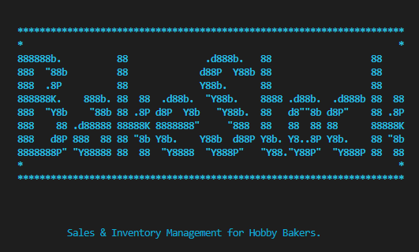
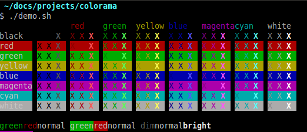
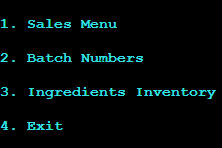
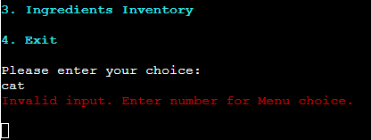
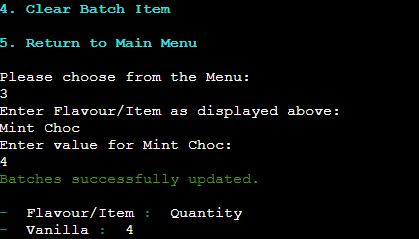
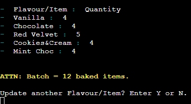
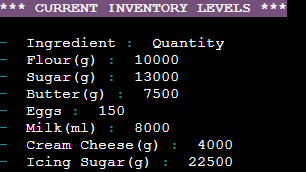
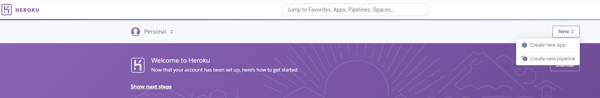
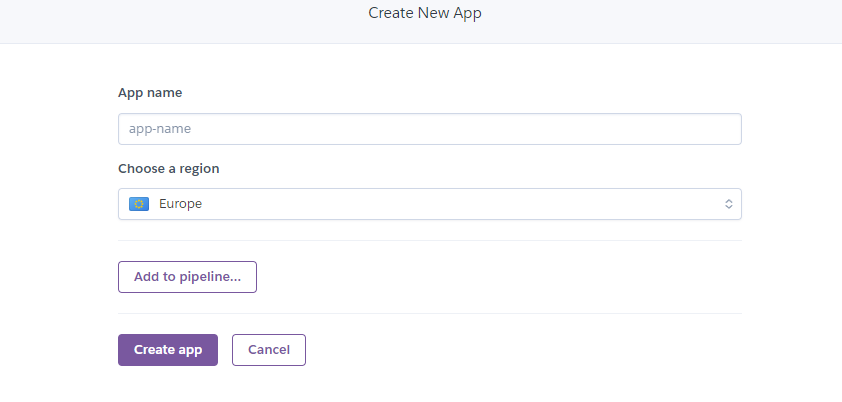
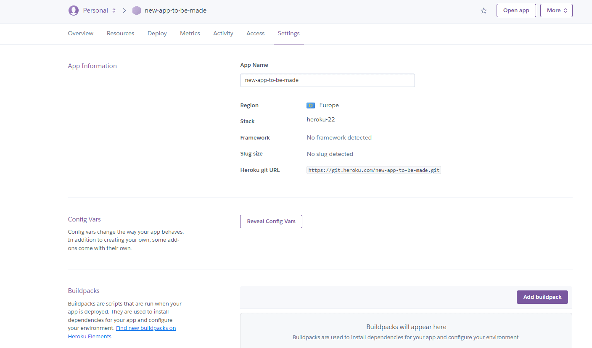

# **BakeStock**
  

  

BakeStock is a Python command line interface (CLI) application designed to be used by hobby or 'small-batch' bakers. The application will allow the user to keep track of daily bakes and sales, batch numbers, and keep track of ingredient types and inventory levels. It is fully customisable and editable to allow the user to change their bakes and inventory items through multiple menus.

View the live application here: [BakeStock](https://bakestock.herokuapp.com/)  

Google Sheets Sales, Batch, Inventory Data (view only) [here.](https://docs.google.com/spreadsheets/d/1ny_lvzMpPjMDCl1ET9uSyVTzBcJko1QDY6DXggS_y5s/edit?usp=sharing)

## Contents
* [**User Experience - UX**](#user-experience-ux)
  * [User Goals](#user-goals)
  * [User Stories](#user-stories)
* [**Creation process**](#creation-process)
  * [Planning](#planning)
  * [Flowcharts](#flowcharts)
  * [Google API SetUp](#google-api-setup)
  * [Google Sheets Data](#google-sheets-data)
  * [Python Logic](#python-logic)
  * [Design Choices](#design-choices)
* [**Features**](#features)
  * [How to Use](#how-to-use)
  * [Future Features](#future-features)
* [**Technologies Used**](#technologies-used)
* [**Python Libraries**](#python-libraries)
* [**Testing**](#testing)
* [**Creation & Deployment**](#creation--deployment)
* [**Credits**](#credits) 

  
# User Experience (UX)  
  
## User Goals
BakeStock has been designed like a 'digital notebook', a clear, interactive, safe way for a hobby baker to keep track of important data. The data will be viewable via the CLI (Command Line Interface) but stored in a connected, secure, Google worksheet which is not directly accessible to the user. Some key user goals that I have kept in mind during this project have been:  

  - It must be easy to navigate, with clear Menu options.
  - An attractive, bright UI to engage the user.
  - Clear instructions are made available for correct data input.
  - Data must be completely editable for different baked items to be recorded.
  - The option to clear data if needed.
  - No dead ends to trap the user at the end of a function.

## User Stories  
  1. As a User, I want an attractive, engaging application. 
  2. As a User, I want to be provided with clear instructions throughout the application.
  3. As a User, I want to be able to record my Sales neatly, even if my baked items are different everyday.
  4. As a User, I want to be able to view my Sales records.
  5. As a User, I want to be able to clear my Sales data, should I need to.
  6. As a User, I want to be able to navigate back to the Main Menu.
  7. As a User, I want to be able to create and remove Batch records.
  8. As a User, I want to be able to view the Batches that I have left to bake.
  9. As a User, I want to be able to update my Batch records by item when a bake is complete.
  10. As a User, I want to be able to view my Ingredient Inventory.
  11. As a User, I want to be able to delete an Ingredient or Quantity.
  12. As a User, I want to be able to be able to update an Ingredient or Quantity.
  

# Creation Process    
  
## Project Planning  

  
## Flowchart  
## Google API SetUp
## Python Logic
## Design Choices      
As this project was focusing on back-end programming, there was no front-end production by myself, a student of the [Code Institute](https://codeinstitute.net/ie/). The CLI code was provided through the use the the CI's [Python Essentials template](https://github.com/Code-Institute-Org/python-essentials-template) and I did not alter the HTML or JavaScript code, choosing to remain with the original view of the interface. _(Please refer to the [Creation & Deployment](#creation--deployment) section of this README to learn how to recreate this project yourself.)_
  
ASCII art was used with a text banner for the Main program intro page and a hidden easter egg for the user...
 - [ASCII banner maker](https://manytools.org/hacker-tools/ascii-banner/) : The BakeStock banner was created using the 'Colossal' font.  

ASCII art for BakeStock banner

  

### Colorama  

  

_Colorama colour and display selection - Credit: [PyPi](https://pypi.org/project/colorama/)_  

The Colorama python library was used to create a bright, engaging UI for the user to receive some form of feedback for their input choices. The library is limited to 8 colours with three display options of 'DIM,NORMAL,BRIGHT', and three formatting options of 'Back,Fore, Style'. There is a difference in how the colours are displayed in the Gitpod workspace and the deployed application, so it is important to regularly compare the outputs to ensure the desired design impact has been reached.

  - The Opening Screen and Program Menus are displayed in the CYAN colour with the BRIGHT setting to make the options easier for he user to read against the black CLI background.  
    

    
CYAN for Menu display

    
    

      
     

  - Any prompted input that the user provides, that does not validate, will receive an 'Error' message printed in RED. This is give the user feedback to pay particular attention to their input as invalid data will not allow them to proceed with the operations.  
    

    
RED for invalid input display

    
    
  
  
   
      
  - Successful input to data update in the Google Sheets provides positive feedback to the user with a GREEN message, informing the user that the data that they have entered has been validated and added to the relevant worksheet.
    

    
GREEN for validation and successful input

    
    
  
    
   

  - To draw the users attention to important information that is not connected to input validation is the colour YELLOW. It is used to inform the user that a Batch consists of 12 baked items, and if the maximum amount of baked items recorded has been reached.
    

    
YELLOW for information that requires attention

    
    

   
    
  - Menu, Batch and Inventory headers are highlighted with a background of MAGENTA, WHITE text and capitalisation to ensure clear legibility for the user. The limited colour palette available in the Colorama library works well together to give a simple and striking UI.
    

    
MAGENTA and WHITE for informative headers

    
    
     
    

# Features

## How to Use
## Future Features
  
# Technologies Used 
   - HTML5
   - JavaScript
   - Python

### Cloud Platforms
   - GitHub
   - Gitpod
   - Google Cloud Platform 
   - Heroku 
  
# Python Libraries  
  
# Testing  

  
# Creation & Deployment    
  
The below steps to creating and setting up a new Python workspace and API credentials has been guided by and adapted from the [Code Institute's](https://codeinstitute.net/ie/) Python walkthrough project 'Love Sandwiches'. Please check each step is relevant to your project needs and change the data entered to suit it.

### Creating a new repository 

Steps to create a new repository.
  

The [Code Institute's Python Essential Template](https://github.com/Code-Institute-Org/python-essentials-template) was used to create a terminal for my Python file to generate it's output.To use this template, please follow these steps:
1. Log in to [GitHub](https://github.com/) or create a new account.
2. Navigate to the above Python template repository.
3. Click '**Use this template**' -> '**Create a new repository**'.
4. Choose a new repository name and click '**Create repository from template**'.
5. In your new repository space, click the green '**Gitpod**' button to generate a new workspace.   

 
  
  
### Activating the Google Drive & Sheets API

Steps to activate the APIs

To access the data in a Google Sheets worksheet using Python code, an API is required. Please follow these steps to set up your APIs:  

1. Navigate to the [Google Cloud Platform](https://cloud.google.com), using an email address/Google account that is registered to you alone.
2. In the Google Cloud Platform Dashboard, create a new project by clicking on the '**Select a Project**' button and choosing the '**New Project**' option. Give your new project a name and click '**Create**'. (Your access credentials are unique to each project, so create a new project for every project that you build.) 
3. Click '**Select Project**' in the blue banner to bring you to your project page.
4. Select '**APIs and Services**' from the left side menu, then select '**Library**'.
5. Use the search bar to search for the two APIs needed for this project, Google Drive API and Google Sheets API. One at time, choose the APIs from the search and click '**Enable**' on their main page. Follow the below steps for the Google Drive API, but only click '**Enable**' for the Google Sheets API. There is no need to download credentials again for it.
6. On the API overview page, click '**Create Credentials**' to generate some credentials which will allow us access to our Google Drive from our Python code.
7. Fill out the forms fields and dropdown menus with the information that is relevant to your project. For mine, I chose **Google Drive API -> Application Data -> No, I'm not using them** (regarding using Kubernetes, App Engine etc)
8. Under Service Account Details, choose a Service Account name and click '**Create**'.
9. In the Role Dropdown box choose **Basic -> Editor** then press '**Continue**'. Click '**Done**' to finish the form if you do not need to grant users access to the service account if it is a personal project.
10. On the next page, click on your new Service Account that has been created, then click on the '**Keys**' tab to '**Add Key**'. Select '**Create New Key**'.
11. Select JSON and '**Create**'. Your json file containing your API credentials will be downloaded to your machine.

    
### Setting up the Gitpod workspace for the APIs

Steps for workspace setup

  
1. In the new Gitpod workspace you've created with the Python Essentials template, click and drag the json file that you created in the above steps, into the Gitpod workspace.  
2. Rename it to `CREDS.json`, if you wish, and open the file. Find the client_email address you previously entered, copy it without the quotes around it.
3. In the Google Sheets file that you have created for this project, click the '**Share**' button and paste the email address into the field, choose '**Editor**', untick '**Notify People**' and click '**Share**'. This allows our project access to the spreadsheet.
4. To ensure the private credentials that you have created do not make their way to the cloud for others to view, add the `creds.json` file to your `gitignore` file before you commit any changes to your repository, and push them to the cloud.
5. Use the command `git status` to check that the `creds.json` file is not staged to be committed.

  
  
    
### Initial Code for connecting to our API with Python

Steps to including the Python/API connection code

  

  

### Deploying to Heroku  

Heroku has been used to deploy this project as Python is used as a back-end language. To allow for accurate testing, I deployed the project to Heroku early on using Automatic Deployment to update the program everytime new code was pushed to my GitHub repository. Here are the steps that I followed to set my project up, guidance was provided by the [Code Institute's](https://codeinstitute.net/ie/) 'Love Sandwiches' project.     

1. Log in to [Heroku](https://id.heroku.com/login) or create an account if you are a new user.
2. Once logged in, in the Heroku Dashboard, navigate to the '**New**' button in the top, right corner, and select '**Create New App**'.

Create new app

  

3. Enter an app name and choose your region. Click '**Create App**'.

Enter app name

  
  
4. In the Deploy tab, click on the '**Settings**', reach the '**Config Vars**' section and click on '**Reveal Config Vars**'. Here you will enter KEY:VALUE pairs for the app to run successfully. In KEY enter `CREDS`, in VALUE, paste in the text content of your `CREDS.json` file. Select '**Add**'.  
5. Repeat this process with a KEY:VALUE pair of `PORT` and `8000`.
6. In the Settings tab, in the Buildpack section, click '**Add Buildpack**', located near the bottom, right of the refreshed screen. One at a time, choose the '**Python**' pack, save changes, then choose the '**NodeJS**' buildpack and save changes. **NB: the Python buildpack _must_ be above the NodeJS buildpack.**
  

Choose Buildpacks

  
  
7. Go to the '**Deploy**' tab and choose GitHub as the Deployment method.
8. Search for the repository name, select the branch that you would like to build from, and connect it via the '**Connect**' button.
9. Choose from '**Automatic**' or '**Manual**' deployment options, I chose the 'Automatic' deployment method. Click '**Deploy Branch**'.
10. Once the waiting period for the app to build has finished, click the '**View**' link to bring you to your newly deployed site.

  

### Forking the GitHub Repositiory

A copy of the original repository can be made through GitHub. Please follow the below steps to fork this repository:  

1. Navigate to GitHub and log in.  
2. Once logged in, navigate to this repository using this link [BakeStock Repository](https://github.com/amylour/BakeStock).
3. Above the repository file section and to the top, right of the page is the '**Fork**' button, click on this to make a fork of this repository.
4. You should now have access to a forked copy of this repository in your Github account.

[GitHub Repository Forking Steps]()
  
  

### Clone this GitHub Repository

A local clone of this repository can be made on GitHub. Please follow the below steps:

1. Navigate to GitHub and log in.
2. The [BakeStock Repositiory](https://github.com/amylour/BakeStock) can be found at this location.
3. Above the repository file section, locate the '**Code**' button.
4. Click on this button and choose your clone method from HTTPS, SSH or GitHub CLI, copy the URL to your clipboard by clicking the '**Copy**' button.
5. Open your Git Bash Terminal.
6. Change the current working directory to the location you want the cloned directory to be made.
7. Type `git clone` and paste in the copied URL from step 4.
8. Press '**Enter**' for the local clone to be created.

[GitHub Repository Clone Steps]()

  
# Credits

## Content References
   - gspread Documentation is used as reference material and guidance throughout the project for the manipulation of data between Python and Google Sheets: [gspread Docs](https://docs.gspread.org/en/latest/index.html)
   - Code Institute's 'Love Sandwiches' project for Google Sheets API and Creds Set-Up: [Code Institute](https://codeinstitute.net/ie/)
   - 101 Computing for the type-text effect, 'screen sleep', and 'clear screen' effects used throughout the project: [Python typing text effect](https://www.101computing.net/python-typing-text-effect/)
   - StackOverflow for providing a solution to display my Sales Data: [Adding tab for data formatting and display](https://stackoverflow.com/questions/4488570/how-do-i-write-a-tab-in-python)
   - Python enumerate tutorial by Tech with Tim for searching through Google Sheet data: [Tech with Tim Youtube](https://www.youtube.com/watch?v=-MZiQaNI0QA)
   - Python enumerate tutorial via Real Python for looping through data items: [Real Python](https://realpython.com/python-enumerate/)
   - Python zip() Function for Parallel Iteration for display of Batch and Inventory items: [Real Python](https://realpython.com/python-zip-function/)
   - Linuxhint for their Colorama tutorial and materials: [Linuxhint Colorama & Python](https://linuxhint.com/colorama-python/)  

Additional reading materials:
   - [Analytics Vidhya](https://www.analyticsvidhya.com/blog/2020/07/read-and-update-google-spreadsheets-with-python/) for more information about Google Sheets and Python Automation.
   - [GitHub Docs](https://docs.github.com/en) for information on cloning and forking the repository.
   - [Geeks for Geeks](https://www.geeksforgeeks.org/python-programming-language/?ref=ghm) for additional Python learning.

## Literature
I used the below book as extra learning material and reference material during the project:  

- [Python Crash Course](https://www.oreilly.com/library/view/python-crash-course/9781492071266/), Author: Eric Matthes, Publisher: No Starch Press, Year: 2019 Edition.

## Media
ASCII art was used twice in the project and were generated by:
- [ManyTools.org](https://manytools.org/hacker-tools/ascii-banner/), for the opening banner.
- [ASCII Art](https://www.asciiart.eu/), for the hidden easter egg.

## Acknowledgements  
- Many thanks to my family for their continued support when I need to talk through ideas and bugs, and for testing my work.
- Thank you to my mentor Rahul Lakhanpal for his support and guidance.
- Thanks and appreciation to my fellow Code Institute students who have offered great support. 

## Project Reflection

[Back to Top](#bakestock)