# **BakeStock**
  

  

BakeStock is a Python command line interface (CLI) application designed to be used by hobby or 'small-batch' bakers. The application will allow the user to keep track of daily bakes and sales, batch numbers, and keep track of ingredient types and inventory levels. It is fully customisable and editable to allow the user to change their bakes and inventory items through multiple menus.

View the live application here: [BakeStock](https://bakestock.herokuapp.com/)  

Google Sheets Sales, Batch, Inventory Data (view only) [here.](https://docs.google.com/spreadsheets/d/1ny_lvzMpPjMDCl1ET9uSyVTzBcJko1QDY6DXggS_y5s/edit?usp=sharing)

## Contents
* [**User Experience/User Interface (UX/UI)**](#user-experienceuser-interface-uxui)
  * [User Goals](#user-goals)
  * [User Stories](#user-stories)
* [**Creation process**](#creation-process)
  * [Planning](#planning)
  * [Flowcharts](#flowcharts)
  * [Google API SetUp](#google-api-setup)
  * [Google Sheets Data](#google-sheets-data)
  * [Python Logic](#python-logic)
  * [Design Choices](#design-choices)
* [**Features**](#features)
  * [How to Use BakeStock](#how-to-use-bakestock)
  * [Future Features](#future-features)
* [**Technologies Used**](#technologies-used)
* [**Libraries & Packages**](#libraries--packages)
* [**Testing**](#testing)
* [**Creation & Deployment**](#creation--deployment)
* [**Credits**](#credits) 

  
# User Experience/User Interface (UX/UI)  
  
## User Goals
BakeStock has been designed like a 'digital notebook', a clear, interactive, safe way for a hobby baker to keep track of important data. The data will be viewable via the CLI (Command Line Interface) but stored in a connected, secure, Google worksheet which is not directly accessible to the user. Some key user goals that I have kept in mind during this project have been:  

  - It must be easy to navigate, with clear Menu options.
  - An attractive, bright UI to engage the user.
  - Clear instructions are made available for correct data input.
  - Data must be completely editable for different baked items to be recorded.
  - The option to clear data if needed.
  - No dead ends to trap the user at the end of a function.

## User Stories  
  1. As a User, I want an attractive, engaging application. 
  2. As a User, I want to be provided with clear instructions throughout the application.
  3. As a User, I want to be able to record my Sales neatly, even if my baked items are different everyday.
  4. As a User, I want to be able to view my Sales records.
  5. As a User, I want to be able to clear my Sales data, should I need to.
  6. As a User, I want to be able to navigate back to the Main Menu.
  7. As a User, I want to be able to create and remove Batch records.
  8. As a User, I want to be able to view the Batches that I have left to bake.
  9. As a User, I want to be able to update my Batch records by item when a bake is complete.
  10. As a User, I want to be able to view my Ingredient Inventory.
  11. As a User, I want to be able to delete an Ingredient or Quantity.
  12. As a User, I want to be able to be able to update an Ingredient or Quantity.
  

# Creation Process    
  
## Project Planning  
I wished to apply some previous experience to my Python project to create a real-world application. Having had a Hobby Baker business in the past, I imagined what tools I would have liked to have used had I grown the business at that time. The most used tool was my notebook, which contained all of the details that I needed to fulfil customer's orders. Had I grown the business to participate in regular Food Markets, I would have upgraded to keeping digital records.  
 
BakeStock was created from this idea and fully planned out using [Lucidchart](https://www.lucidchart.com/) to create a flowchart which represented my end goals. Once I had investigated the terminal that would run this application, I made sure to stay within it's restrictions and referred back to my flowchart frequently. My main goals for the application were:  

- Provide options for the user to access different areas of the application.
- Pull user data from the worksheets and display the data legibly.
- Take user input, text and numerical, and validate the input.
- Update the Google Sheets worksheets with the user data.
- Aim for an application that allows a user to create, edit, view and delete data.

I tackled each section by dividing the tasks up equally and following a production line of writing my code, continuously testing my code and testing the user's input to ensure accurate validation. As there are a few different Menus in this application, it was vital that the user did not meet any dead ends.  
  
I had decided to use Google Sheets to store any data that was entered or edited from the terminal. This required extra learning to ensure that I could manage the data appropriately. Learning resources are credited in the [Credits](#credits) section. Many learning curves were present in this journey, with writing code to calling certain cells and ranges, but I am glad that I pushed myself to incorporate using APIs in this project to fulfill the needs of the application.

  
## Flowchart   
To help with planning my project, I used Lucidchart to produce a flowchart of my expected functions and their flow.

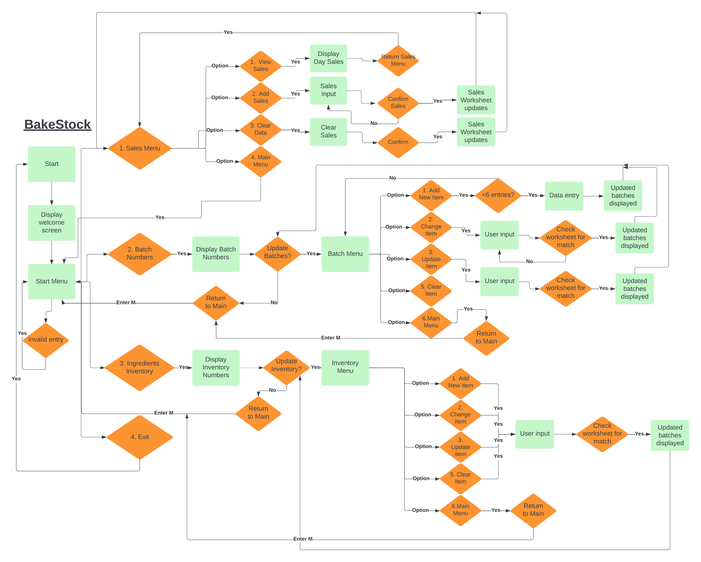  

   

## Google API SetUp   
Prior to starting any program function code, the relevant Credentials and API set up needed to take place. This process is detailed in the [Creation & Deployment](#creation--deployment) section. Security was an important factor with the connecting of a Google Account (one that I created solely for the project) to access the Google Sheets worksheet. Steps were followed carefully to ensure that no important files like, `CREDS.json`, were pushed to the cloud for the public to view. Guidance for the setting up of these authorisations and credentials, was provided through the Code Institute's Full Stack Software Development course.

Google Sheets was used to store any entered user data and called upon when data was manipulated and updated. It was used to simulate a database, as the user will have no direct interaction with the actual worksheets. All data entry and manipulation takes place within the terminal. 

Clear instructions are printed in the terminal instructing the user in how to enter the data, so that it may be displayed correctly on its output, within the scope of this project. For future development, I would wish to dive further into the learning of the Python Data Analysis Library - [Pandas](https://pandas.pydata.org/) to upgrade the UX/UI of the project.  

   

## Python Logic  
With this being my first Python project, my main goal was to create an application that accessed, displayed and edited data successfully from Google Sheets worksheets; to simulate a database. I will admit that my Scope for this project was regularly adjusted when my simulataneous learning of the gspread library reached it's limits in what I could create. Reminding myself to consider the MVP kept me on track.

I began by creating simple functions which pushed the flow of user input through the application. Menus were created using if/elif statements and user input was validated using while loops and try/except statements. 

From these initial menus, smaller functions were added that controlled the movement and manipulation of data. Functions containing enumerate() were essential in pulling the data from specific matched locations in the worksheets, once the user's input was validated to be present within the worksheets. I constantly tested the validation functions throughout the project build so that I would not be left with gaps in the flow of the application. 

Once I confirmed one section's function to be successful, I investigated whether the code could be reused in other sections with similar purposes. In some instances it could, once the data handling remained the same. In other situations, code was personalised for the individual function, particulary in how the data was displayed. Parallel iteration using the python zip() function was needed in displaying Batch and Inventory data, whilst Sales Data was displayed using the Python '\t' whitespace character. This gave space between each item in the Sales Data sheet, when represented in the terminal.  

   

## Design Choices      
As this project was focusing on back-end programming, there was no front-end production by myself, a student of the [Code Institute](https://codeinstitute.net/ie/). The CLI code was provided through the use the the CI's [Python Essentials template](https://github.com/Code-Institute-Org/python-essentials-template) and I did not alter the HTML or JavaScript code, choosing to remain with the original view of the interface. The CLI application allowed a display window of 80 characters, and a vertical scrollbar. _(Please refer to the [Creation & Deployment](#creation--deployment) section of this README to learn how to recreate this project yourself.)_
  
ASCII art was used with a text banner for the Main program intro page and a hidden easter egg for the user...
 [ASCII banner maker](https://manytools.org/hacker-tools/ascii-banner/) : The BakeStock banner was created using the 'Colossal' font.  

ASCII art for BakeStock banner

  

### Colorama  

  

_Colorama colour and display selection - Credit: [PyPi](https://pypi.org/project/colorama/)_  

The Colorama python library was used to create a bright, engaging UI for the user to receive some form of feedback for their input choices. The library is limited to 8 colours with three display options of 'DIM, NORMAL, BRIGHT', and three formatting options of 'Back, Fore, Style'. There is a difference in how the colours are displayed in the Gitpod workspace and the deployed application, so it is important to regularly compare the outputs to ensure the desired design impact has been reached.

  - The Opening Screen and Program Menus are displayed in the CYAN colour with the BRIGHT setting to make the menu options easier for the user to read against the black CLI background.  
    

    
CYAN for Menu display

    
    

      
     

  - Any prompted input that the user provides, that does not validate, will receive an 'Error' message printed in RED. This gives the user feedback to pay particular attention to their input as invalid data will not allow them to proceed with the operations.  
    

    
RED for invalid input display

    
    
  
  
   
      
  - Successful input to data update in the Google Sheets provides positive feedback to the user with a GREEN message, informing the user that the data that they have entered has been validated and added to the relevant worksheet.
    

    
GREEN for validation and successful input

    
    
  
    
   

  - To draw the users attention to important information that is not connected to input validation is the colour YELLOW. It is used to inform the user that a Batch consists of 12 baked items, and if the maximum amount of baked items recorded has been reached.
    

    
YELLOW for information that requires attention

    
    

   
    
  - Menu, Batch and Inventory headers are highlighted with a background of MAGENTA, WHITE text and capitalisation to ensure clear legibility for the user. The limited colour palette available in the Colorama library works well together to give a simple and striking UI.
    

    
MAGENTA and WHITE for informative headers

    
    
  
  
     
    

# Features

## How to Use BakeStock 

### Main Menu  
After the opening screen of BakeStock ASCII art, the user is greeted by the below menu. Users may enter the number displayed beside the menu options. Any input not connected to the menu choices will be confirmed as invalid and the user is prompted to enter a numbered menu option.
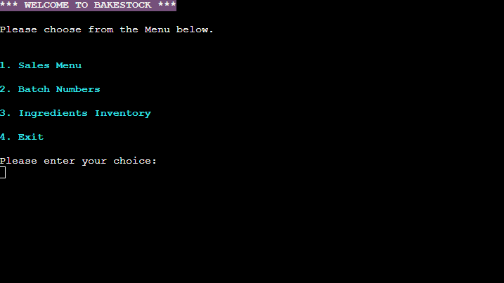  
  
    
### Sales Menu    
Similar to the opening menu, the user is prompted to enter their menu option choice. Th user is informed of any invalid input and prompted to try again.
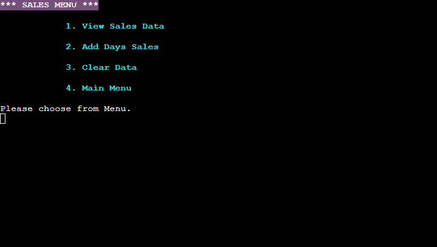
  
  
### Sales Figures   
Sales figures are printed to the terminal and are as current as the data that is stored in the Google Sheet. The data will refresh during the user session if they choose to add any sales figures at the end of the day. If the Sales Worksheet is refreshed, then a Yellow text warning is displayed to the user informing them of 'No data' available, incase the user is thinks that the program has stalled in its data display. The user can return to the Sales Menu by following the instructions to enter 's'.
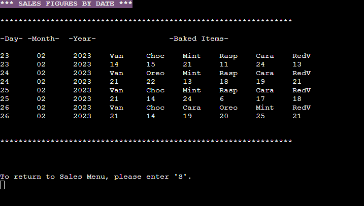  
  
    
### Records Sales Figures  
The user is prompted to enter the Sales figures by first entering the date and the abbreviated baked items. This is done so that the Sales table will display correctly in the terminal and allows different baked items to be recorded daily. Further learning of data formatting, for future versions, will allow me to remove the abbreviated restriction for the user so that the data displays with full words. Data entry is restricted to 9 columns within the worksheet to assist in the Sales display. The user is informed of this if they exceed the value restriction.

Records Sales Figures Feature

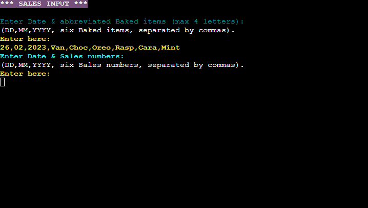

  
  
### Clear Sales Data  
The user is prompted to enter the words 'CLEAR DATA' exactly as displayed if they wish to clear the Sales worksheet. Again, user input validation has been very important here to ensure no actions are executed if the user did not intend for them. Several steps of input are required to ensure no mistakes are made.

Clear Sales Figures Feature

  

### Batch Numbers  
Batch numbers are displayed beneath the Batch menu banner. A yellow text warning alerts the user that the batch quantity consists of 12 items. 

View Batch Numbers Feature

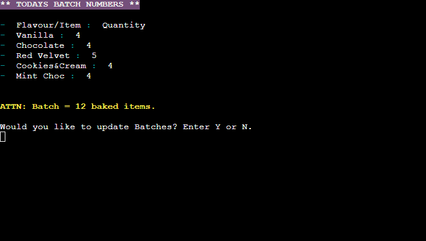

   

### View Batch Menu  
Users are greeted with the Batch Menu providing several options.

Batch Menu Feature

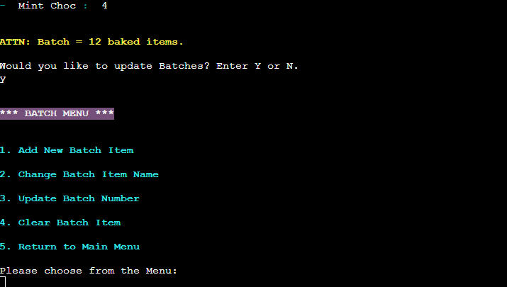

   
 
### Add Item, Change Item, Update Item, Clear Item in Batches  
 Multiple options are provided to allow for customisation by the user. The Flavours/Items section is editable by the user to allow for different baked items everyday. Similar to making a to-do list in a notebook, the baker/user can update the required batch numbers at the end of the day, ready for the next baking day. When they complete a batch, these numbers can be edited back to zero to reflect this. This gives the baker real-time information on what is left to do every time they view the batch numbers.

Add, Change, Update, Clear Batch Item

### Ingredient Inventory  
Following a similar UI from the earlier Menu options, the Inventory displays the current stock levels. 

Ingredient Inventory Feature

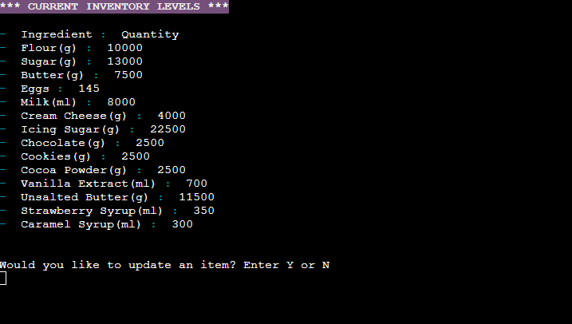

   

### Inventory Menu  
Users are greeted by an Inventory Menu providing several options.

Inventory Menu Feature

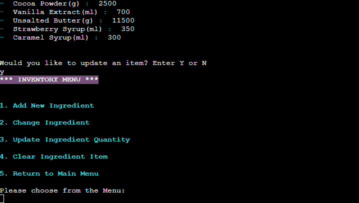

 
  
### Add Item, Change Item, Update Item, Clear Item in Inventory  
These items are customisable with an 'Ingredient' section for displaying the ingredient name and unit in brackets. The 'Quantity' value is numerical only and may be updated when bakes have been processed. Similar to the Batch menu, the UX prompts, validates and acts on user input.

Add, Change, Update, Clear Inventory Item

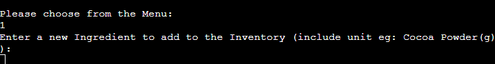

  

### Exit  
Some users may like to have an option to feel that they have exited the program. Although it's function is very minor, I felt that it was important to include and to thank the user for using BakeStock.

Program Exit

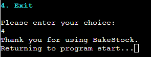

   
    
   

-----  

## Data Model - Google Sheets
The data provided by the user is inputted into the respective Google Sheets worksheets. The worksheet is accessed by myself as the only Editor but I will include a View only link to show the distribution of data for the project. [Google Worksheets](https://docs.google.com/spreadsheets/d/1ny_lvzMpPjMDCl1ET9uSyVTzBcJko1QDY6DXggS_y5s/edit?usp=sharing)  

- The Sales worksheet contains the Dates and Baked Items entered by the user.  

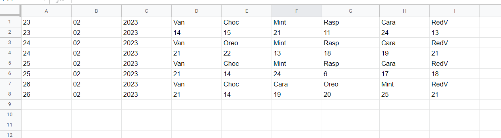  
 
- The Batch worksheet contains a permanent header of 'Flavour/Item' and 'Quantity'. The user may only enter six baked items and their quantitites. This is to maintain the display provided in the 'View Sales Data' Option within the program.  

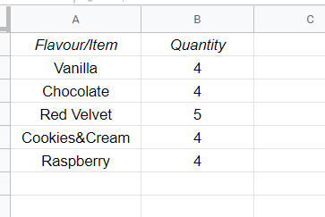 

- The Inventory worksheet contains permanent headers of 'Ingredient' and 'Inventory'. There is no restriction to the vertical space of the worksheet and the user may enter as many Ingredients as needed. However, coming from a baking background, there will be no need to exceed the terminal's displayed space as a Hobby Baker.  
  
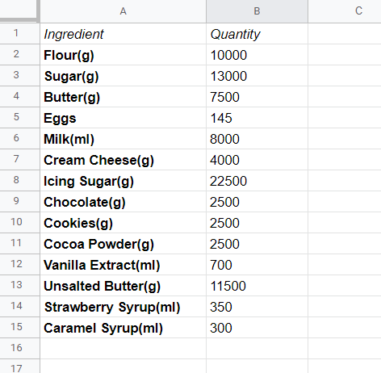
  

 

## Future Features  
There are a few features that I feel could benefit from additions in the future:
- The Sales Menu could benefit from a way of tracking business income in and out. I had hoped to include a Profits tracker, but through it's planning I realised that were a lot more moving pieces when money is involved and my Python skills need to develop further to meet this Scope.
- I would like to add a Recipe section that keeps a digital record of the baker's most used recipes, for easy reference.
- Through further learning I would like to provide a better way to display the Sales figures, perhaps through the library 'tabulate', to make it easier for the user to view the data.
- I would like to revisit this project after I have graduated from the course and have more experience with Python, to refactor the code and apply the DRY(Don't Repeat Yourself) principle to reduce the length of my code.

  
# Technologies Used 
   - HTML5 - provide within the Code Institute's [Python Essentials template](https://github.com/Code-Institute-Org/python-essentials-template) 
   - JavaScript - as above.
   - Python - Python code written is my own unless referenced in the source code or the below Credits section.
   - [Lucidchart](https://www.lucidchart.com/pages/) - used to create the flowchart needed during project planning.
   - [GitHub](https://github.com/) - used for hosting the program's source code.
   - [Gitpod](https://www.gitpod.io/) - used as a workspace for developing the code and testing the program.
   - Git - used for version control.
   - [Google Sheets](https://docs.google.com/spreadsheets/) - used for storing edited and saved user data.
   - [Google Cloud Platform](https://cloud.google.com/) - used to provide the APIs for connecting the data sheets with the Python code.
   - [Heroku](https://heroku.com/apps) - used for deploying the project.
   - [PEP8 Validator](https://pep8ci.herokuapp.com/#) - used for validating the Python code.
   - [Tiny PNG](https://tinypng.com/) - used to compress images.

   

# Libraries & Packages 
   - **gspread** - gspread was imported and used to add, remove and manipulate data in the connected Google Sheets worksheets.  

   - **google.oauth.service_account** - This library was used for the authentication needed to access the Google APIs for connecting the Service Account with the Credentials function. A `CREDS.json` file was generated from this with the details needed for the API to access my Google acccount which holds the Google Sheets worksheet containing the applications data. When deploying to Heroku, this information is then stored in the config var section to ensure the application will run.  

   - **time & sys** -the time & sys libraries were used for the text-typing effect for typePrint and typeInput statements to create a visual effect 0f the text appearing on screen in real time.  

   - **os** - os library was used to add the clearScreen() function to assist in creating a neater flow from Menu options by clearing the screen for the user's choice from the Menu to be displayed. 

   - **colorama** - colorama was inported to give the terminal text colour and style to create a bright and engaging UI and to provide some visual feedback when a user's input is validated.

  
# Testing  
I have created an additional file for my Manual Testing and Validation this can be found here: [TESTING.md](/TESTING.md)
  
# Creation & Deployment    
  
The below steps to creating and setting up a new Python workspace and API credentials has been guided by and adapted from the [Code Institute's](https://codeinstitute.net/ie/) Python walkthrough project 'Love Sandwiches'. Please check each step is relevant to your project needs and change the data entered to suit it.

### Creating a new repository 

Steps to create a new repository.
  

The [Code Institute's Python Essential Template](https://github.com/Code-Institute-Org/python-essentials-template) was used to create a terminal for my Python file to generate it's output. To use this template, please follow these steps:
1. Log in to [GitHub](https://github.com/) or create a new account.
2. Navigate to the above Python template repository.
3. Click '**Use this template**' -> '**Create a new repository**'.
4. Choose a new repository name and click '**Create repository from template**'.
5. In your new repository space, click the green '**Gitpod**' button to generate a new workspace.   

 
  
-----  

### Activating the Google Drive & Sheets API

Steps to activate the APIs

To access the data in a Google Sheets worksheet using Python code, an API is required. Please follow these steps to set up your APIs:  

1. Navigate to the [Google Cloud Platform](https://cloud.google.com), using an email address/Google account that is registered to you alone.
2. In the Google Cloud Platform Dashboard, create a new project by clicking on the '**Select a Project**' button and choosing the '**New Project**' option. Give your new project a name and click '**Create**'. (Your access credentials are unique to each project, so create a new project for every project that you build.) 
3. Click '**Select Project**' in the blue banner to bring you to your project page.
4. Select '**APIs and Services**' from the left side menu, then select '**Library**'.
5. Use the search bar to search for the two APIs needed for this project, Google Drive API and Google Sheets API. One at time, choose the APIs from the search and click '**Enable**' on their main page. Follow the below steps for the Google Drive API, but only click '**Enable**' for the Google Sheets API. There is no need to download credentials again for it.
6. On the API overview page, click '**Create Credentials**' to generate some credentials which will allow us access to our Google Drive from our Python code.
7. Fill out the forms fields and dropdown menus with the information that is relevant to your project. For mine, I chose **Google Drive API -> Application Data -> No, I'm not using them** (regarding using Kubernetes, App Engine etc)
8. Under Service Account Details, choose a Service Account name and click '**Create**'.
9. In the Role Dropdown box choose **Basic -> Editor** then press '**Continue**'. Click '**Done**' to finish the form if you do not need to grant users access to the service account if it is a personal project.
10. On the next page, click on your new Service Account that has been created, then click on the '**Keys**' tab to '**Add Key**'. Select '**Create New Key**'.
11. Select JSON and '**Create**'. Your json file containing your API credentials will be downloaded to your machine.

-----  

### Setting up the Gitpod workspace for the APIs

Steps for workspace setup

  
1. In the new Gitpod workspace you've created with the Python Essentials template, click and drag the json file that you created in the above steps, into the Gitpod workspace.  
2. Rename it to `CREDS.json`, if you wish, and open the file. Find the client_email address you previously entered, copy it without the quotes around it.
3. In the Google Sheets file that you have created for this project, click the '**Share**' button and paste the email address into the field, choose '**Editor**', untick '**Notify People**' and click '**Share**'. This allows our project access to the spreadsheet.
4. To ensure the private credentials that you have created do not make their way to the cloud for others to view, add the `creds.json` file to your `gitignore` file before you commit any changes to your repository, and push them to the cloud.
5. Use the command `git status` to check that the `creds.json` file is not staged to be committed.

  
  
-----  

### Initial Code for connecting to our API with Python

Steps to including the Python/API connection code

1. The code needed to ensure your APIs connect correctly can be found at the top of the `run.py` file connected to this project. It is important that you remember to pass the exact same name as your spreadsheet to the `SHEET = GSPREAD_CLIENT.opn('your-filename-here')` code, or else gspread will throw an error.
2. The command `pip3 install gspread google-auth` is needed to install the gspread package for handling the worksheet data and the google-auth package to allow access to the Google Sheets account via the Credentials we downloaded earlier. Use the above command in the Gitbash terminal to install.
3. Please refer to the `run.py` file for the import, SCOPE, CREDS, SCOPED CREDS, GSPREAD CLIENT, SHEET code that is needed to connect the APIs and change any data that is personal to your project.

  
-----  

### Deploying to Heroku  

Heroku has been used to deploy this project as Python is used as a back-end language. To allow for accurate testing, I deployed the project to Heroku early on using Automatic Deployment to update the program everytime new code was pushed to my GitHub repository. Here are the steps that I followed to set my project up, guidance was provided by the [Code Institute's](https://codeinstitute.net/ie/) 'Love Sandwiches' project.     

1. Log in to [Heroku](https://id.heroku.com/login) or create an account if you are a new user.
2. Once logged in, in the Heroku Dashboard, navigate to the '**New**' button in the top, right corner, and select '**Create New App**'.

Create new app

  

3. Enter an app name and choose your region. Click '**Create App**'.

Enter app name

  
  
4. In the Deploy tab, click on the '**Settings**', reach the '**Config Vars**' section and click on '**Reveal Config Vars**'. Here you will enter KEY:VALUE pairs for the app to run successfully. In KEY enter `CREDS`, in VALUE, paste in the text content of your `CREDS.json` file. Select '**Add**'.  
5. Repeat this process with a KEY:VALUE pair of `PORT` and `8000`.
6. In the Settings tab, in the Buildpack section, click '**Add Buildpack**', located near the bottom, right of the refreshed screen. One at a time, choose the '**Python**' pack, save changes, then choose the '**NodeJS**' buildpack and save changes. **NB: the Python buildpack _must_ be above the NodeJS buildpack.**
  

Choose Buildpacks

  
  
7. Go to the '**Deploy**' tab and choose GitHub as the Deployment method.
8. Search for the repository name, select the branch that you would like to build from, and connect it via the '**Connect**' button.
9. Choose from '**Automatic**' or '**Manual**' deployment options, I chose the 'Automatic' deployment method. Click '**Deploy Branch**'.
10. Once the waiting period for the app to build has finished, click the '**View**' link to bring you to your newly deployed site.

  
-----  

### Forking the GitHub Repositiory

A copy of the original repository can be made through GitHub. Please follow the below steps to fork this repository:  

1. Navigate to GitHub and log in.  
2. Once logged in, navigate to this repository using this link [BakeStock Repository](https://github.com/amylour/BakeStock).
3. Above the repository file section and to the top, right of the page is the '**Fork**' button, click on this to make a fork of this repository.
4. You should now have access to a forked copy of this repository in your Github account.

-----  

### Clone this GitHub Repository

A local clone of this repository can be made on GitHub. Please follow the below steps:

1. Navigate to GitHub and log in.
2. The [BakeStock Repositiory](https://github.com/amylour/BakeStock) can be found at this location.
3. Above the repository file section, locate the '**Code**' button.
4. Click on this button and choose your clone method from HTTPS, SSH or GitHub CLI, copy the URL to your clipboard by clicking the '**Copy**' button.
5. Open your Git Bash Terminal.
6. Change the current working directory to the location you want the cloned directory to be made.
7. Type `git clone` and paste in the copied URL from step 4.
8. Press '**Enter**' for the local clone to be created.
  
 

# Credits

## Content References
   - gspread Documentation is used as reference material and guidance throughout the project for the manipulation of data between Python and Google Sheets: [gspread Docs](https://docs.gspread.org/en/latest/index.html)
   - Code Institute's 'Love Sandwiches' project for Google Sheets API and Creds Set-Up: [Code Institute](https://codeinstitute.net/ie/)
   - 101 Computing for the type-text effect, 'screen sleep', and 'clear screen' effects used throughout the project: [Python typing text effect](https://www.101computing.net/python-typing-text-effect/)
   - StackOverflow for providing a solution to display my Sales Data: [Adding tab for data formatting and display](https://stackoverflow.com/questions/4488570/how-do-i-write-a-tab-in-python)
   - Python enumerate tutorial by Tech with Tim for searching through Google Sheet data: [Tech with Tim Youtube](https://www.youtube.com/watch?v=-MZiQaNI0QA)
   - Python enumerate tutorial via Real Python for looping through data items: [Real Python](https://realpython.com/python-enumerate/)
   - Python zip() Function for Parallel Iteration for display of Batch and Inventory items: [Real Python](https://realpython.com/python-zip-function/)
   - Linuxhint for their Colorama tutorial and materials: [Linuxhint Colorama & Python](https://linuxhint.com/colorama-python/)  

Additional reading materials:
   - [Analytics Vidhya](https://www.analyticsvidhya.com/blog/2020/07/read-and-update-google-spreadsheets-with-python/) for more information about Google Sheets and Python Automation.
   - [GitHub Docs](https://docs.github.com/en) for information on cloning and forking the repository.
   - [Geeks for Geeks](https://www.geeksforgeeks.org/python-programming-language/?ref=ghm) for additional Python learning.

## Literature
I used the below book as extra learning material and reference material during the project:  

- [Python Crash Course](https://www.oreilly.com/library/view/python-crash-course/9781492071266/), Author: Eric Matthes, Publisher: No Starch Press, Year: 2019 Edition.

## Media
ASCII art was used twice in the project and were generated by:
- [ManyTools.org](https://manytools.org/hacker-tools/ascii-banner/), for the opening banner.
- [ASCII Art](https://www.asciiart.eu/), for the hidden easter egg.

## Acknowledgements  
- Many thanks to my family for their continued support when I need to talk through ideas and bugs, and for testing my work.
- Thank you to my mentor Rahul Lakhanpal for his support and guidance.
- Thanks and appreciation to my fellow Code Institute students who have offered great support. 

[Back to Top](#bakestock)