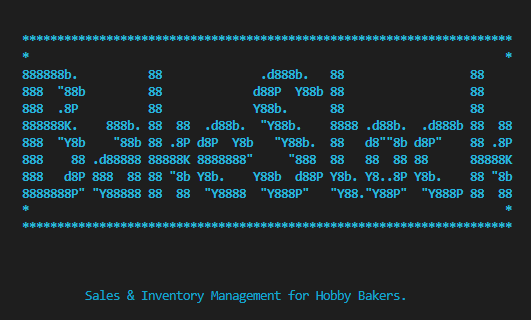

# **BakeStock**
  

  

BakeStock is a Python command line interface (CLI) application designed to be used by hobby or 'small-batch' bakers. The application will allow the user to keep track of daily bakes and sales, batch numbers, and keep track of ingredient types and inventory levels. It is fully customisable and editable to allow the user to change their bakes and inventory items through multiple menus.

[View the live application here.](https://bakestock.herokuapp.com/)  

[Sales, stock, inventory data here.](https://docs.google.com/spreadsheets/d/1ny_lvzMpPjMDCl1ET9uSyVTzBcJko1QDY6DXggS_y5s/edit?usp=sharing)

## Contents
* [**User Experience - UX**](#user-experience-ux)
  * [App Goals](#app-goals)
  * [User Stories](#user-stories)
* [**Creation process**](#creation-process)
  * [Planning](#planning)
  * [Flowcharts](#flowcharts)
  * [Google API SetUp](#google-api-setup)
  * [Google Sheets Data](#google-sheets-data)
  * [Python Logic](#python-logic)
  * [Design Choices](#design-choices)
* [**Features**](#features)
  * [How to Use](#how-to-use)
  * [Future Features](#future-features)
* [**Technologies Used**](#technologies-used)
* [**Python Libraries**](#python-libraries)
* [**Testing**](#testing)
  * [Bugs](#bugs)
  * [Validator](#validator)
* [**Deployment**](#deployment)
* [**Credits**](#credits)  

  
# User Experience (UX)  
  
## App Goals
## User Stories  
  
# Creation Process
  
## Flowcharts  
## Google API SetUp
## Python Logic
## Design Choices   
   - [ASCII banner maker](https://manytools.org/hacker-tools/ascii-banner/) : The BakeStock banner was created using the 'Colossal' font.  
     

  
# Features

## How to Use
## Future Features
  
# Technologies Used  
  
# Python Libraries  
  
# Testing  
  
## Bugs
- Colorama not working [Install pip colorama](https://tinyurl.com/msk3uknk)
- Colorama preventing app working in Heroku [requirements.txt](https://tinyurl.com/3bxmr4kj)
## Validator  
  
# Deployment  

### Forking the GitHub Repositiory

A copy of the original repository can be made through GitHub. Please follow the below steps to fork this repository:  

1. Navigate to GitHub and log in.  
2. Once logged in, navigate to this repository using this link [BakeStock Repository](https://github.com/amylour/BakeStock).
3. Above the repository file section and to the top, right of the page is the 'Fork' button, click on this to make a fork of this repository.
4. You should now have access to a forked copy of this repository in your Github account.

### Clone this GitHub Repository

A local clone of thie repository can be made on GitHub. Please follow the below steps:

1. Navigate to GitHub and log in.

  
# Credits

## Content References
   - [Python typing text effect](https://www.101computing.net/python-typing-text-effect/)
   - [Adding tab for data formatting and display](https://stackoverflow.com/questions/4488570/how-do-i-write-a-tab-in-python)
   - [Clearing a certain range in Google Sheets](https://stackoverflow.com/questions/58876935/how-to-clear-a-range-in-google-sheet-via-gspread)