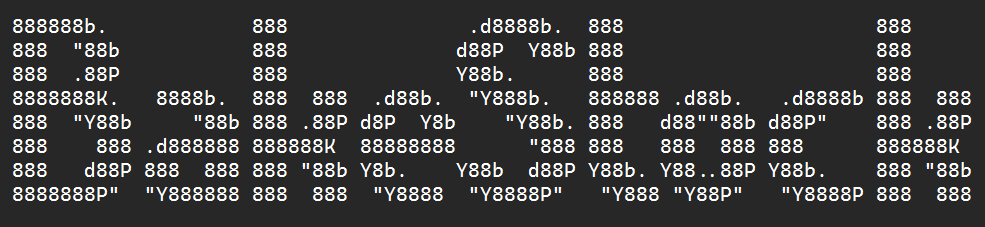

# **BakeStock**
  

  

BakeStock is a Python command line interface (CLI) application designed to be used by small batch bakeries or 'micro-bakeries'. The application will allow the user to keep track of daily bakes and sales, calculate the next days bake batch numbers and keep track of ingredient inventory levels, alerting the user to any low ingredient levels.

You can view the live application here. **
Sales, stock, inventory data here. **

## Contents
* [**User Experience - UX**](#user-experience-ux)
  * [App Goals](#app-goals)
  * [User Stories](#user-stories)
* [**Creation process**](#creation-process)
  * [Planning](#planning)
  * [Flowcharts](#flowcharts)
  * [Google API SetUp](#google-api-setup)
  * [Google Sheets Data](#google-sheets-data)
  * [Python Logic](#python-logic)
  * [Design Choices](#design-choices)
* [**Features**](#features)
  * [How to Use](#how-to-use)
  * [Future Features](#future-features)
* [**Technologies Used**](#technologies-used)
* [**Python Packages**](#python-packages)
* [**Testing**](#testing)
  * [Bugs](#bugs)
  * [Validator](#validator)
* [**Deployment**](#deployment)
* [**Credits**](#credits)  

  
# User Experience (UX)  
  
## App Goals
## User Stories  
  
# Creation Process
  
## Flowcharts  
## Google API SetUp
## Python Logic
## Design Choices   
   - [ASCII banner maker](https://manytools.org/hacker-tools/ascii-banner/) : The BakeStock banner was created using the 'Colossal' font.  
     

  
# Features

## How to Use
## Future Features
  
# Technologies Used  
  
# Python Packages  
  
# Testing  
  
## Bugs
## Validator  
  
# Deployment  
  
# Credits

## Content References
   - [Python typing text effect](https://www.101computing.net/python-typing-text-effect/)
   