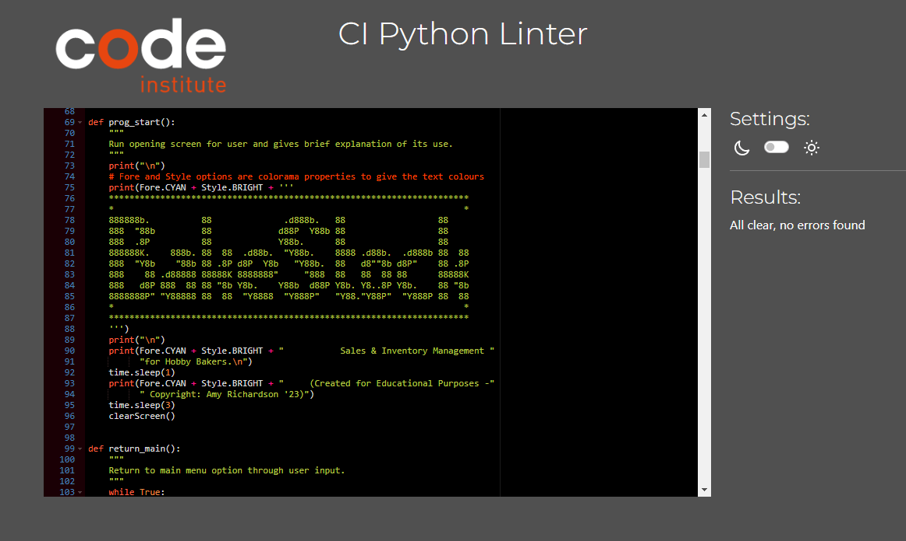

# Testing for BakeStock    
  
## Testing Contents  
  
1. [Validation](#validation)
2. [Browser Testing](#browser-testing)
3. [Manual Testing](#manual-testing)
4. [Bugs](#bugs)  
  
-----
  
## Validation  
The code was validated using the [Code Institute's](https://pep8ci.herokuapp.com/#) Pep8 Linter through its production. No errors were found in its final testing. The results are displayed below:
  
  
    
All user input has been validated regularly to ensure no dead ends for the user or acceptance of invalid user input. Opportunity for incorrect input should only be present when the user is prompted to record Sales, Batch or Inventory Data, which requires human precision to enter the new data. Any error in input is out of the control of the application and the clear input prompts which are printed for the user to see. This is discussed further in the [Manual Testing](#manual-testing) section below.

## Browser Testing  
BakeStock was tested through the Heroku app website on the following browsers with no issues arising:  
- Google Chrome (Version 110.0.5481.105)
- Mozilla Firefox (Version 109.0.1)  
- Microsoft Edge (Version Version 110.0.1587.5) 
    
BakeStock was tested on Safari using an iPad but user input was not recognised. I believe this to be a known issue with the Python template, as discovered whilst searching through the Code Institute's Slack archives. I did not have access to Safari on Desktop to check if this was a similar issue.  

Although I tested whether BakeStock would run on Android, which it did, there was no requirement to ensure that the application was responsive on all sizes of devices. As a result there is no Device Testing section to this project.
  
## Manual Testing  

### Testing User Stories 

-----
  
  1. As a User, I want an attractive, engaging application.  

    - Colorama library used to produce text with engaging colours and meaning  
    - GREEN for valid input
    - RED for invalid input
    - YELLOW for the users attention to be drawn to important information
    - CYAN for the Menus to have increased legibility against the terminal background
    

  2. As a User, I want to be provided with clear instructions throughout the application.  

    - All sections requiring user input are signposted with clear instructions on how to proceed
    - User is prompted with instructions when input provided is invalid
    - Data entry points that require large amounts of data eg 'Add Sales Data' require the user to confirm the data before it is updated to the worksheet
  

  3. As a User, I want to be able to record my Sales neatly, even if my baked items are different everyday.  

    - The user has full customisation over which baked items are entered into the Sales sheet
    - Clear instructions are provided for the user to follow when enetering the data  
  

  4. As a User, I want to be able to view my Sales records.  

    - Guided by clear Menu options from the program beginning, the user can access their Sales data easily
    - Sales records are displayed neatly in the terminal's restricted space  
      
  
  5. As a User, I want to be able to clear my Sales data, should I need to.  

    - The user can clear their data by following the instructions within the 'Clear Data' menu option, within the 'Sales Menu'
  

  6. As a User, I want to be able to navigate back to the Main Menu.  

    - All Menu options provide exit back to the Main Menu by requesting that the user typr 'M' when prompted.
  
  7. As a User, I want to be able to create and remove Batch records.  

    - Batch entries can be edited by the user to add, change and clear batch items by matching the user's input request with the batch item displayed
    
  
  8. As a User, I want to be able to view the Batches that I have left to bake.  

    - Batch quantities can be viewed in the Batch Menu and update immediately when edited by the user
  
  9. As a User, I want to be able to update my Batch records by item when a bake is complete.  

    - Batch quantities can be edited via the Batch Menu option to 'Update Batch Number'
  
  10. As a User, I want to be able to view my Ingredient Inventory.  

    - The Ingredient Inventory can be accessed through the Main Menu by choosing option 3. 'Ingredients Inventory' 
  
  11. As a User, I want to be able to delete an Ingredient or Quantity.  

    - Individual Ingredients and Quantities can be cleared by following the instructions provided in the 'Update Inventory' menu option.
  
  12. As a User, I want to be able to be able to update an Ingredient or Quantity.  

    - Ingredients and their Quantities can be updated by following the instructions provided in the 'Update Inventory' menu option.
    
## Bugs
- Colorama not working [Install pip colorama](https://tinyurl.com/msk3uknk)
- Colorama preventing app working in Heroku [requirements.txt](https://tinyurl.com/3bxmr4kj)    
  
